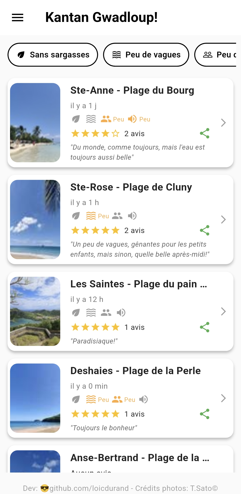
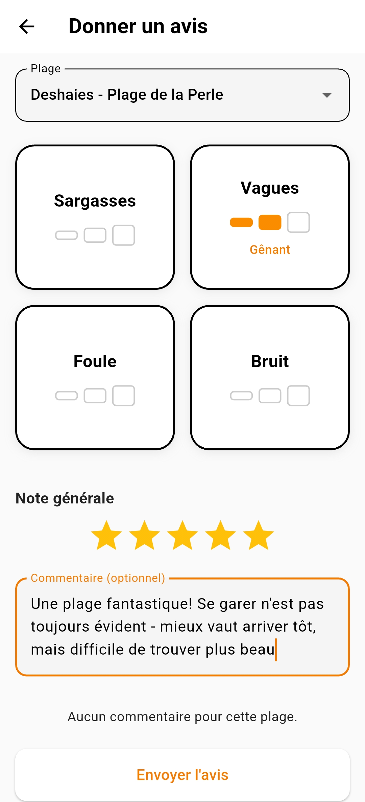
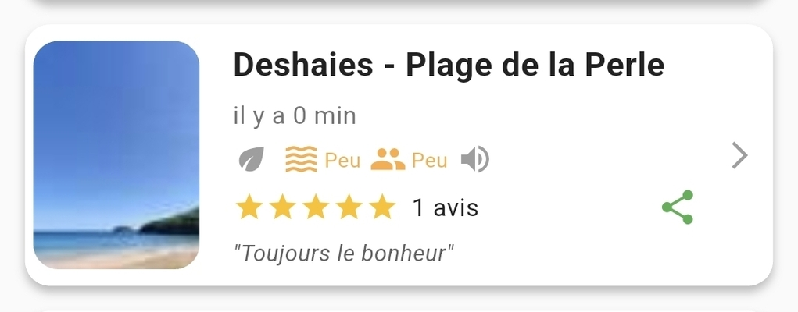

# Kantan Gwadloup! - *Profite de la Guadeloupe!* 🏝️

&nbsp;[](https://opensource.org/licenses/MIT)

## Introduction

Chaque samedi, chaque dimanche, se pose la même question: quelle plage aujourd'hui?
S'en suit toujours le même dialogue: 
- Anse-Bertrand?
- Ça serait super mais s'il y a des sargasses?
- Port-Louis?
- Bonne idée, mais j'ai peur qu'il y ait du bruit, 

Etcetera, etcetera...

Via cette application, les premiers arrivés à la plage peuvent signaler aux autres les éventuelles gênes rencontrées sur place.
L'application se veut simple: présence de ***sargasses, vagues importantes, bruit ou foule*** sont les seuls critères qui peuvent être signalés.

Pourquoi ne pas avoir ajouté la météo? Parce que celle-ci change vite. Il serait dommage que certains renoncent à se rendre sur telle ou telle plage, au détriment des commerçants ou de la vie locale, alors qu'une forte pluie peut laisser place à un ciel radieux en quelques minutes seulement!

Avec des filtres intelligents et un partage **WhatsApp**, vous trouverez la plage parfaite sans surprise.

## 📱 Fonctionnalités

- **Consultation des plages** : Liste des plages populaires, triées par nombre de reports, avec notes moyennes et derniers avis.
- **Filtres intelligents** : Filtrez par "sans sargasses", "peu de vagues", "peu de monde" ou "calme".
- **Reports en temps réel** : Soumettez un avis sur les conditions (niveaux 0-3 pour sargasses, vagues, foule, bruit) + note et commentaire.
- **Limite anti-spam** : 1 report par 2h par utilisateur (UID anonyme).
- **Partage WhatsApp** : Partagez un résumé d'une plage directement sur WhatsApp.
- **Thème clair/sombre** : Suit le système ou forcé manuellement.
- **Images par plage** : Photos locales pour chaque plage (pas d'upload user pour modération zéro).
- **Offline** : Cache local pour les derniers reports (via streams Firestore).

## 📋 Prérequis

- Flutter SDK (version 3.0+)
- Firebase (pour Firestore + Auth anonyme)

## 🔧 Installation

1. **Cloner le repo** :
   ```
   git clone https://github.com/loicdurand/kantan-gwadloup.git
   cd kantan-gwadloup
   ```

2. **Installer les dépendances** :
   ```
   flutter pub get
   ```

3. **Configurer Firebase** :
   - Créer un projet Firebase (console.firebase.google.com).
   - Activer Firestore + Authentication (méthode "Anonymous").
   - Télécharger `google-services.json` (Android) et le placer dans `android/app/`.
   - Lancer `flutterfire configure` pour générer `firebase_options.dart`.

4. **Règles Firestore** (pour test) :
   ```javascript
   rules_version = '2';
   service cloud.firestore {
     match /databases/{database}/documents {
       match /reports/{document} {
         allow read, write: if request.auth != null;
       }
     }
   }
   ```

5. **Lancer l'appli** :
   ```
   flutter run
   ```

## 📖 Utilisation

1. **Accueil** : Liste des plages, filtres en haut.
2. **Clic sur une plage** : Détails + bouton "Donner un avis".
3. **Report** : Sélectionnez la plage, niveaux (0-3), note, commentaire → Envoyez !
4. **Partage** : Icône WhatsApp sur la carte → Message prêt à envoyer.
5. **Paramètres** : Menu hamburger → Thème clair/sombre.

## 📸 Screenshots

  

**Accueil avec filtres**

  

**Report avec barres de niveau**



**Carte avec image et détails**

## 🤝 Contribuer

Contributions bienvenues !  
1. Forker le repo.
2. Crée une branche (`git checkout -b feature/nouvelle-plage`).
3. Commit (`git commit -m 'Ajout plage nouvelle'`).
4. Push (`git push origin feature/nouvelle-plage`).
5. Pull Request.

## 📄 Licence

MIT License — Voir [LICENSE](LICENSE).

## 🙏 Remerciements

- **Développé avec passion par Loïc Durand** — Créateur et mainteneur.
- **Images gracieusement fournies par Tomomi Sato** — Photographe locale.
- **Aide technique** : Grok (xAI) pour le debugging et la formation - c'était mon premier projet Flutter! 
